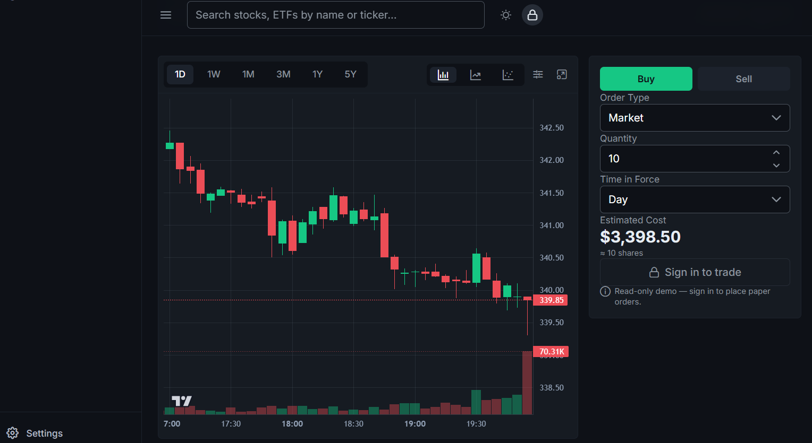

# xtrading

A responsive, full-stack stock trading dashboard — a portfolio project pairing a polished
Vue 3 + TypeScript front end with a Hono backend-for-frontend that serves real market data
and real (paper) order flow via Alpaca.

**Live demo:** [stockmarketapp1.netlify.app](https://stockmarketapp1.netlify.app/)

| Watchlist | Portfolio |
| --- | --- |
|  |  |

| Chart + order panel | Markets |
| --- | --- |
|  |  |

## Features

- **Watchlist** — search any symbol, follow it, and watch live prices stream in over a
  WebSocket (persisted locally).
- **Portfolio** — real Alpaca paper-account equity, buying power, day P/L, an allocation
  donut, a performance chart, and a holdings table.
- **Chart** — candlestick + volume (`lightweight-charts`), 1D–5Y timeframes, SMA overlays,
  and an order panel wired to real paper trades.
- **Orders** — place/cancel paper orders (market, limit, stop) with a review-and-confirm
  step; filter by status and watch fills land in the portfolio.
- **Markets** — index cards, gainers/losers/most-active tables, and a sector heatmap for
  the US and Canada.
- **Responsive** — a left sidebar on desktop, a bottom tab bar on mobile; dark/light theme
  toggle.

## Tech stack

| Layer | Choice |
| --- | --- |
| Front end | Vue 3 (Composition API, `<script setup>`) + TypeScript + Vite |
| State | Pinia |
| UI | PrimeVue 4 (Aura preset) + Tailwind CSS v4 (`tailwindcss-primeui`) |
| Charts | `lightweight-charts` (TradingView) |
| Backend-for-frontend | Hono, deployed as a Netlify Function |
| Market data | Finnhub (symbol search, quotes, live WebSocket) |
| Trading | Alpaca (paper account — candles, account, positions, orders) |
| Hosting | Netlify (static SPA + one serverless Function), Git-based continuous deployment |

## Architecture (brief)

```
View → Pinia store → services/ (thin fetch client) → /api/* → server/app.ts (Hono BFF) → Finnhub / Alpaca
```

The BFF (`server/app.ts`) owns every provider key and is mounted twice: locally via
`@hono/node-server` (`server/index.ts`, `npm run dev:api`) and in production as a single
Netlify Function (`netlify/functions/api.ts`). The one exception is the live watchlist
price stream, which still connects **frontend-direct** to Finnhub's WebSocket with a
read-only, client-exposed key — Netlify Functions can't hold a persistent connection open.
See [`docs/04-architecture.md`](docs/04-architecture.md) and
[ADR-021](docs/07-decisions.md#adr-021--deploy-to-netlify-functions-bff-ws-stays-frontend-direct-auth-gap-accepted)
for the full reasoning, and the rest of [`docs/`](docs/README.md) for the design system,
feature list, and the full decision log.

> **Known limitations (by design, documented in ADR-021):** the Finnhub WebSocket key is
> visible in the client bundle (read-only, no trading power — quota risk only). Existing account
> and order reads are public; order writes and all agent controls require owner authentication.

## Getting started

Requires Node `^22.18.0` or `>=24.12.0`.

```bash
npm install
cp .env.example .env.local   # fill in your own API keys (see below)
npm run dev                  # Vite (:5173) + the BFF (:8787) together
```

### API keys

`.env.local` (never committed) needs:

| Variable | Used by | Get one at |
| --- | --- | --- |
| `FINNHUB_API_KEY` | BFF: symbol search + quotes | [finnhub.io/dashboard](https://finnhub.io/dashboard) |
| `VITE_FINNHUB_API_KEY` | Browser: live watchlist WebSocket | same, a free key works |
| `ALPACA_API_KEY_ID` / `ALPACA_API_SECRET_KEY` | BFF: candles, account, positions, orders (paper) | [app.alpaca.markets/paper/dashboard](https://app.alpaca.markets/paper/dashboard/overview) |

See [`.env.example`](.env.example) for the full list, including optional host overrides.

### Scripts

| Command | What it does |
| --- | --- |
| `npm run dev` | Vite + the BFF together |
| `npm run dev:web` / `npm run dev:api` | just the front end / just the BFF |
| `npm run build` | type-check + production build (`dist/`) |
| `npm run preview` | preview the production build |
| `npm run type-check` | `vue-tsc --build` across `src/` + `server/` + `netlify/` |
| `npm run lint` | oxlint + eslint (autofix) |
| `npm run format` | prettier |
| `npm run test:unit` | vitest |

## Deployment

Deployed on **Netlify** via Git-based continuous deployment — every push to `main` builds
and deploys automatically, no manual step. `netlify.toml` configures the build, the
`/api/*` → Function redirect, and an SPA fallback redirect (Vue Router uses
`createWebHistory`). See [ADR-021](docs/07-decisions.md) for what changed (and what
deliberately didn't) to get there.

## Documentation

Detailed docs live in [`docs/`](docs/README.md): [overview](docs/01-overview.md),
[tech stack](docs/02-tech-stack.md), [design system](docs/03-design-system.md),
[architecture](docs/04-architecture.md), [features](docs/05-features.md),
[roadmap](docs/06-roadmap.md), and the [decision log](docs/07-decisions.md).

## Disclaimer

This is a portfolio project. All trading is **paper trading** (Alpaca paper account) —
no real money is ever involved.

## AI research and paper-trading agent

Open **AI Research** (`/ai-research`) after signing in. The local Node server now supports
validated AI reports, deterministic scanning/regime/strategy, independent risk and sizing,
manual paper approval, a durable SQLite journal, controls/emergency stop, performance/daily
reviews, an opt-in scheduler, and historical replay using the same strategy/risk functions.
Existing manual dashboard trading remains available. Live/custom Alpaca hosts are rejected.

The agent starts **PAUSED / RESEARCH_ONLY** on every restart. `.env.example` documents the
disabled defaults and server-only AI configuration (`OPENAI_API_KEY`, `OPENAI_RESEARCH_MODEL`).
See [local setup, modes, recovery and limitations](docs/10-ai-agent-setup.md) and
[the architecture review](docs/09-ai-trading-architecture.md). No API secrets go to the browser.
The durable agent is local-only; existing Netlify dashboard deployment does not run it.
`npm run backtest -- archived-frames.json results.json` runs offline replay. Tests mock
providers and never submit real or paper trades to an external broker.
