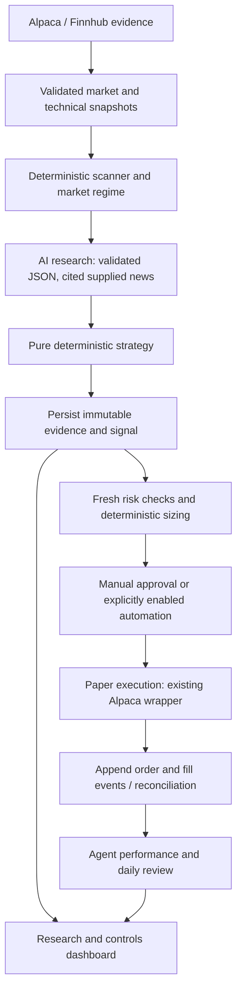

# AI paper-trading extension: architecture review and phased plan

## Current implementation

The repository is a Vue 3/TypeScript SPA with Pinia, PrimeVue, Tailwind and lightweight-charts. Hono provides the backend in `server/app.ts`. `server/index.ts` loads local environment configuration and starts the local server; `netlify/functions/api.ts` mounts the same app as a function. Vite proxies `/api` locally. No database, job worker, research agent, or persistent journal currently exists. Watchlist/theme persistence is browser localStorage; provider caching is process-local TTL storage.

| Concern | Existing implementation |
| --- | --- |
| Provider credentials/HTTP | `server/alpacaClient.ts`: `alpacaRequest`, data and trading hosts; `server/finnhub.ts`: Finnhub HTTP wrapper |
| Quotes/search | Finnhub `fetchQuotes`/`searchSymbols`, `/api/quotes`, `/api/search`; browser live ticks in `src/services/marketStream.ts` |
| Candles | `server/alpaca.ts:fetchBars`, `/api/candles`, `src/stores/chart.ts`, `PriceChart.vue`; split-adjusted IEX bars with timeframe presets |
| Fundamentals/day statistics | `server/finnhub.ts:fetchMetrics`, `server/stats.ts:fetchStockStats`, `/api/stats` |
| Market context | `server/markets.ts`: snapshots, clock, ETF indices, movers, sectors |
| Account/positions | `server/alpaca.ts:fetchAccount/fetchPositions`, `/api/account`, `/api/positions`, `src/stores/portfolio.ts` |
| Submit paper order | `OrderPanel.vue` review/confirm -> `src/stores/orders.ts:place` -> `src/services/marketData.ts:placeOrder` -> authenticated `POST /api/orders` -> `server/alpaca.ts:placeOrder` -> `alpacaRequest` -> `/v2/orders` |
| Cancel/poll | Orders store/service -> authenticated `DELETE /api/orders/:id` -> `cancelOrder`; GET list/detail polls working orders |
| Performance | `fetchPortfolioHistory` -> `/api/portfolio/history` -> portfolio store -> `PortfolioView`, `PortfolioChart`, `AllocationDonut`; account-wide, not agent-attributed returns |
| Authentication | `server/auth.ts`: owner passcode, signed HttpOnly session cookie, seven-day expiry; existing account and order reads public |

Order writes invalidate account, positions, history and orders caches. The order store refreshes portfolio state and polls working orders roughly every five seconds. Preserve these paths rather than replacing the dashboard.

Reuse the existing layout/navigation, auth store/dialog, `StatCard`, `PriceTag`, `LivePrice`, `EmptyState`, `TableSkeleton`, PrimeVue tables/tags/dialogs and chart components. New research state belongs in a separate Pinia store, not in the existing order ticket.

## Security and correctness findings

- Before this change, an environment host override could target live Alpaca or an arbitrary credential destination. The shared transport now permits only HTTPS official paper/data hosts and rejects redirects. Existing manual paper trading remains available. Future automated submission must additionally require explicit `TRADING_MODE=paper` at submission time.
- Alpaca secrets are server-only. The Finnhub WebSocket key remains browser-visible; quota exposure is an existing limitation.
- Public account/order reads remain an existing privacy limitation. New research endpoints require owner authentication. Before exposing automation remotely, add robust login/rate limiting, origin validation and restricted agent reads/controls.
- Display mappers substitute zero for some missing values and omit quote timestamps. Research must use validated provider evidence, not those display DTOs. Risk checks will also need fresh, strictly validated account state including cash, account restrictions, all pending orders and reservations.
- No durable journal exists yet. Never permit agent execution before transactional persistence, idempotency and reconciliation exist. Ambiguous broker timeouts must be reconciled using a durable client order ID, never blindly retried.
- Netlify functions cannot own a durable local SQLite journal or persistent scheduler. Run the eventual agent in the local Node process with one writer; hosted automation needs a separately designed persistent runtime.
- Existing unrelated files `docs/08-local-setup.md` and `Microsoft/` were left alone. No `.env.local` values were printed or changed.

## Target data flow

The model has no execution tools. Research scores are bounded interpretations, never authoritative prices or position sizes. Missing/invalid/stale required evidence produces NO_TRADE in the future strategy layer. Every evaluation receives a decision ID before processing, including failures. The strategy receives explicit evidence and an evaluation timestamp, not access to the clock or providers.

## Exact file plan and phase gates

| Phase | Add / modify | Completion gate |
| --- | --- | --- |
| 1: review | This document; README, ADR log | Existing paths identified; additive design |
| 2: evidence | Add `server/config/trading.ts`, `server/research/{validation,technicalIndicators,marketData,fundamentals,news,evidence}.ts`, `src/types/research.ts`, `server/research/research.test.ts`; extend `server/{alpaca,alpacaClient,finnhub,app}.ts`, `.env.example` | Deterministic calculations, null handling, stale checks, provider failure tests; read-only authenticated endpoint |
| 3: AI | Add `server/research/{aiResearch,researchSchema,prompt}.ts`, AI tests; expand shared types/routes | Strict runtime JSON schema, scores 0-100, supplied-news citation validation, bounded timeout; malformed/API failure -> NO_TRADE |
| 4: selection/strategy | Add `server/agent/{scanner,marketRegime,strategy}.ts`, strategy tests | Configurable weights and BUY/HOLD/SELL/NO_TRADE tested; deterministic factors separate from AI interpretation |
| 5: risk | Add `server/agent/{riskManager,positionSizer}.ts`, risk tests | Cash, equity, exposure, pending orders, market clock, loss/cooldown, daily count, data age/quality/confidence, sizing and duplicate protection tested |
| 6: manual execution | Add `server/agent/paperExecution.ts`; extend existing Alpaca order DTO/wrapper for client IDs, notional, fills and fresh risk reads | RESEARCH_ONLY default; manual proposal approval requires revalidation; no executable route enabled before phase 7 durability gate |
| 7: journal | Add `server/persistence/{database,migrations,journal}.ts`, `server/agent/reconcile.ts`; ignore local DB files | SQLite transactions and unique reservations/client IDs; immutable evidence + config/prompt/model versions; append fill events; crash recovery; DB failure blocks writes |
| 8: UI | Add `src/{services,stores}/research.ts`, `src/views/AIResearchView.vue`, `src/components/research/{AgentControls,ResearchTable,ResearchDetail,TradeExplanation}.vue`, `server/agent/routes.ts`; modify router/navigation/app | Research, confidence, signals, rejection reasons and fill state visible; authenticated pause/resume/disable/emergency stop; stop never liquidates |
| 9: analytics | Add `server/agent/{performance,dailyReview}.ts`, `src/components/research/AgentPerformance.vue` | Fill-based realized outcomes, unrealized marks, equity/drawdown, SPY aligned returns, deposits/withdrawals accounted for; daily report persisted |
| 10: automation | Add `server/agent/{scheduler,controller,logger}.ts`; wire only local `server/index.ts` | Persisted disabled default; serial cycles, restart safety, leases/reservations, signal transitions; fresh risk check immediately before submission; all failure scenarios tested |
| 11: backtest | Add `server/backtest/{engine,execution,evidence}.ts` and tests | Same strategy/risk logic; archived available-at timestamps; next-bar execution, costs/slippage, no future news/fundamentals or future-adjustment leakage |

Proposed SQLite models: immutable `decisions` (input evidence/config versions/report/signal/risk), `order_intents` (unique decision and client ID, reserved exposure), append-only `order_events`/`fills`, `equity_samples`, `daily_reviews`, `scan_runs`, and singleton persisted `agent_state`. Use migrations and transactions; do not store secrets. Agent analytics must distinguish manual trades in the shared account. A journal write failure is an execution blocker, including before order submission.

## Phase 2 usage and conventions

Start as usual with `npm run dev`. Sign in through the existing dashboard, then request `GET /api/research/evidence/AAPL` on the same origin. This returns evidence only; it does not invoke an LLM, generate a trade signal, store a journal entry or place an order. Provider failures are represented by null evidence, an errors list and `eligible: false`. Invalid symbols return 400. This endpoint is owner-only even though older demo reads remain public.

Configuration lives in `server/config/trading.ts` with environment overrides documented in `.env.example`. All AI automation remains off and effective mode is RESEARCH_ONLY. `requirePaperAutomation` is the future execution gate, not an active scheduler. Existing manual paper orders do not require AI enablement.

Technical calculations use completed daily bars (current New York date excluded), 252 sessions for the 52-week approximation, SMA-seeded EMA, Wilder RSI/ATR, and sample standard deviation of 20 daily log returns (not annualized). Returns and distances are fractions. The snapshot's technical price basis is the most recent completed close; the live market price is separate. Relative volume is cumulative current-session IEX volume divided by 20 completed IEX sessions, not time-of-day normalized or consolidated volume. Do not apply consolidated-volume thresholds to it.

The daily-history age limit is conservative elapsed time, not a full exchange-calendar gap check. Calendar completeness, corporate-action consistency and intraday execution freshness require further checks before automation. Current-day partial bars never enter daily indicators. Freshness uses source timestamps, not fetch/cache time. Missing latest trade timestamp makes evidence ineligible. Older/short-history securities retain null indicators rather than invented values.

Fundamentals retain Finnhub native ratio/percentage units, except market cap converted from millions to USD. Unsupported forward P/E, PEG, revenue total and free cash flow stay null. `financialPeriodAsOf: null` explicitly means the feed does not establish point-in-time availability; these observations cannot be substituted into historical backtests. News is separated into company and general market scopes, deduplicated by URL, limited to the configured recent window and excludes future dates. Selection is deterministic; sentiment belongs to Phase 3.

Provider references: [Finnhub official API specification](https://github.com/Finnhub-Stock-API/finnhub-go/blob/master/api/openapi.yaml), [Alpaca historical data](https://alpaca.markets/sdks/python/api_reference/data/stock/historical.html). Actual provider entitlement/coverage must be verified on the configured account; Phase 2 tests mock all providers and never submit trades.

## Current scope

Phases 1-11 now have local implementations. The table above records the original file plan;
the actual modules are under `server/research`, `server/agent`, `server/persistence`, and
`server/backtest`, with the new UI at `src/views/AIResearchView.vue`. SQLite uses Node's built-in
driver; runtime JSON validation uses the same bounded schema sent to the model without a new
dependency. All automation remains disabled by default. See [the operational guide](10-ai-agent-setup.md)
for setup, exact execution modes, recovery, analytics conventions and replay limitations.
Passing mocked tests does not establish profitability or verify account-specific provider entitlements.

The Phase 2 conventions above describe the initial delivery. The data layer now also validates
completed history against Alpaca's exchange calendar. Phase 3 added schema-validated AI research;
Phases 4-7 added scanner/strategy/risk, paper execution and SQLite durability; Phases 8-10 added the
dashboard, analytics/reviews and local scheduler. Phase 11 is archived-evidence, next-open replay,
not a historical fundamentals/news acquisition service. The AI cannot change strategy settings.
